# DataBridge

---

## Contents

- [Overview](#overview)
- [Do I Need This](#do-i-need-this)
- [Why Was This Made?](#why-was-this-made)
- [What Does This Do?](#what-does-this-do)
  - [Deep MIDI Integration](#deep-midi-integration)
  - [Support for Live Performance](#support-for-live-performance)
  - [Auto-modulation](#auto-modulation)
  - [Audio Warping](#audio-warping)
- [Disclaimers](#disclaimers)
- [Installation](#installation)
  - [Quit Reason](#quit-reason)
  - [Physical MIDI Port](#physical-midi-port)
  - [Install Package Locally](#install-package-locally)
  - [Install Files](#install-files)
  - [Configure Workspace File](#configure-workspace-file)
- [Keyboard Controls](#keyboard-controls)
  - [Standard Interface](#standard-interface)
    - [Clock On/Off](#clock-on-off)
    - [Edit Min](#edit-min)
    - [Edit Max](#edit-max)
    - [Bipolar/Unipolar](#bipolar-unipolar)
  - [Advanced Interface](#advanced-interface)
    - [Edit Curve](#edit-curve)
    - [Edit Step](#edit-step)
  - [Master Mono Mix](#master-mono-mix)
    - [Stereo Width](#stereo-width)
- [Basic Usage](#basic-usage)

## Overview

**DataBridge** is an advanced MIDI control surface designed to provide a scalable, modular network of responsive connections between rack devices in **Propellerhead Reason 7+**.

Support for MIDI input is included and was designed to be hardware agnostic wherever possible. This allows both legacy and modern hardware to be used interchangeably.

## Do I Need This?

It depends whether you want to incorporate _organic sound design_ into your projects and/or _live performance capabilities_ into your workflows. If you prefer to be more scientific with all aspects of your work, this might not suit your tastes.

## Why Was This Made?

This project represents the best efforts at answering the call for missing features within **Propellerhead Reason 7** upon its release by providing a strong and comprehensive implementation of MIDI response that allows for live performance and organic sound design.

In short, it was made to redefine what is possible in **Reason**.

## What Does This Do?

- #### Deep MIDI Integration

  - Interaction with MIDI is now hardware agnostic, allowing for easy setup of multiple simultaneously connected device types including TouchOSC.

- #### Support for Live Performance

  - Powerful implementation of chained control mappings allow for distributed networks of MIDI response whose expressive capabilities are only limited by one's own imagination and computer specs.
  - This concept was taken even further with long live sets and duos in mind by wrapping support for distributed MIDI response inside a system of virtual layers; enabling the entire rack to be controlled using a scene/page system.

- #### Auto Modulation

  - An optional advanced feature allows for interpolation between values for knobs, sliders, and any other controls that can receive Remote Overrides.
  - Smoothness can be controlled using a custom wave table and transition speed setting.
  - Automation can even be automated to modulate itself, eliminating the need for automation lanes -- _and the CPU consumption caused by them._

- #### Audio Warping

  - A second optional advanced feature allows samples to be pitched in nonlinear ways while still preserving their original timing. Think of it as audio transpose with note glide.
  - Different time-stretching algorithms will give different results, allowing audio captures through the technique to become metallic, robotic, or tonal

---

## Disclaimers

> This guide will show examples based on **MacOS Mojave 10.14** and a **Native-Instruments Maschine Mk2** as the connected MIDI device. _Please substitute your MIDI hardware where applicable._
>
> This guide also assumes that **no other MIDI settings have already been specified** prior to the addition of these control surfaces. Additional troubleshooting may be required if you have a unique MIDI configuration already present in Reason.

> **Use of this system effectively removes Undo functionality from Reason while it is in operation. _This change is not permanent and will not harm your install._ This system is provided open source as-is and without warranty.**

## Installation

1. #### Quit Reason

   - This installation process requires Reason to be closed completely.

2. #### Physical MIDI Port

   - Attach a physical MIDI 5-pin In and Out port to your computer.
   - Physically loop these ports with a male-male **MIDI loopback cable** (Out port to In port)
     > **NOTE:**
     >
     > - **MIDI over IP with CopperLAN has been tested and is supported by the system.**
     > - **All other virtual ports like LoopBe1 will not work.**

3. #### Install Package Locally

   - **Download** this project as a zip file and extract it into a directory of your choice.
   - You can also use `git clone` over **SSH** if you have `git` installed.

      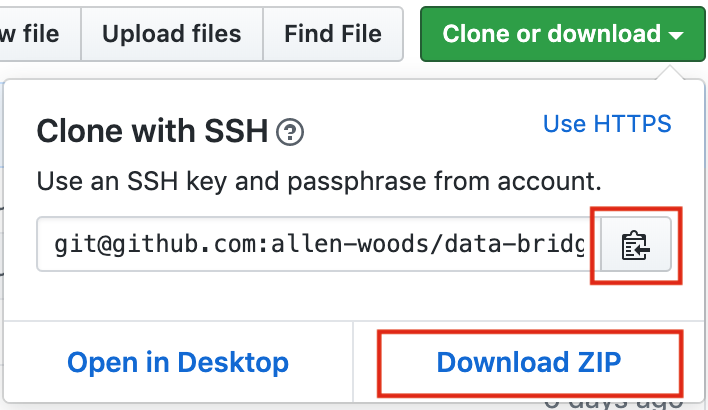

4. #### Install Files

   - Locate the `Codecs/Lua Codecs` folder in your local install of this project.
   - Move the `DataBridge` folder into the `Codecs/Lua Codecs` folder used by your install of **Reason**.
   - Locate the `Maps` folder in your local install of this project.
   - Move the `DataBridge` folder into the `Maps` folder used by your install of **Reason**.
     > **For Help with Step 4, Please See:** [Control Remote](https://www.propellerheads.com/blog/control-remote)

5. #### Configure Workspace File

   - Start **Reason**.
   - Navigate to the `Templates and Patches` folder in your local install of this project.
   - Open the `Local Workspace.reason` file.
   - Navigate to the **Options** menu and turn on **Enable Keyboard Control**.

      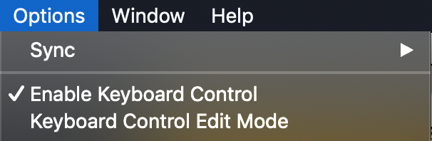

   - Locate the `DB Main` Combinator in the rack.

      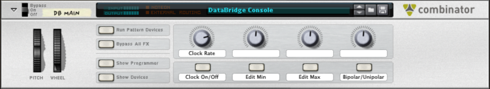

   - Turn on **Show Devices** to reveal the patch contents.
   - Configure the output port of each **External MIDI Instrument** (**EMI**)to use the Out port you looped in [step 2 of this section](#physical-midi-port), as shown in the example below.

      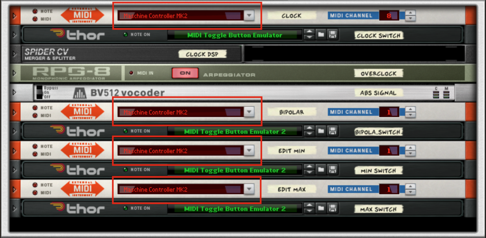

   - Locate the `DB Curve` Combinator in the rack.

      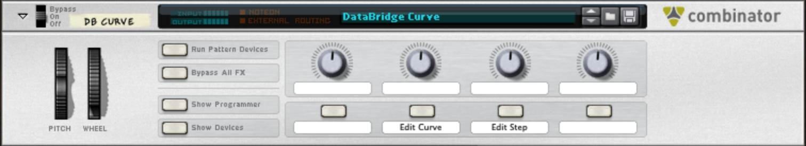

   - Configure its **EMI** outputs in the same manner as in the `DB Main` Combinator's patch.

      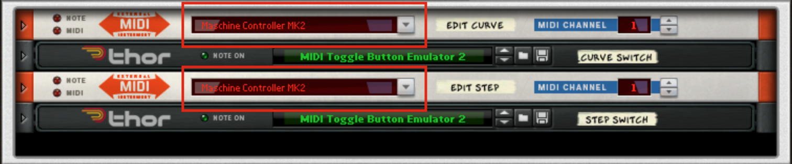

   - Save the song file somewhere official. This will be your song template going forward.
   - Once `Local Workspace.reason` has been saved, close it.
   - Navigate to **Preferences > General > Default Song > Template**.
   - Set the `Local Workspace.reason` file as your new default song template as shown below.

      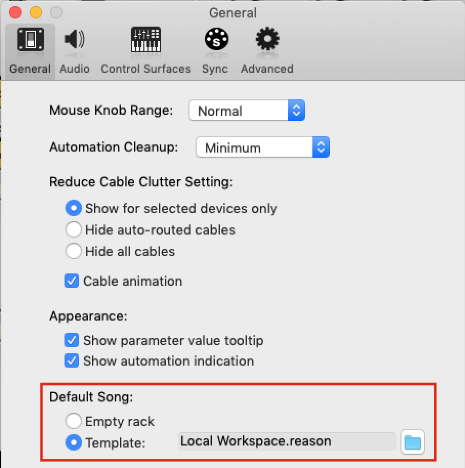

> **NOTE:** _You can rename the `Local Workspace.reason` file to anything you prefer. File names remain standardized for the sake of readability._

---

## Keyboard Controls

The following **Keyboard Controls** are embedded in the `Local Workspace.reason` template:

- ### Legend

  - #### Standard Interface

    | DB Main                                        |                |
    | :--------------------------------------------- | :------------- |
    | <a id="clock-on-off">Clock On/Off</a>          | **Shift + /**  |
    |  Edit Min                 | **Shift + ,**  |
    |  Edit Max                 | **Shift + .**  |
    |  Bipolar/Unipolar | **Shift + \\** |

  - #### Advanced Interface

    | DB Curve                           |               |
    | :--------------------------------- | :------------ |
    |  Edit Curve | **Shift + ;** |
    |  Edit Step   | **Shift + [** |

  - Figure 1:

    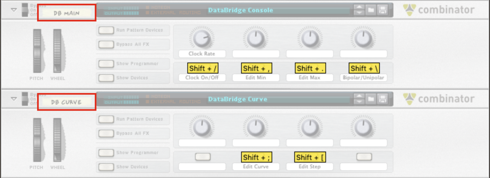

  - #### Master Mono Mix

    **DataBridge** also includes a pre-configured **mastering suite** called `Send 10` that includes a master mono mix fader. The mastering suite can be deleted without compromising the functionality of DataBridge if you want to remove it.

    | Mono Mix                              |               |
    | :------------------------------------ | :------------ |
    | Stereo Width | **Shift + M** |

  - Figure 2:

    

## Hardware Setup

**DataBridge** uses a select number of **MIDI Control Change** (**CC**) values to perform editing functions from hardware. These CC values effectively duplicate the Combinator buttons found on `DB Main` and `DB Curve` in the rack. This enables performers or producers to achieve the same results without having to stop using their controller.

The following CC values are reserved by the DataBridge system:

- ### Legend

  - #### Surface: DataBridge MIDI Controller

    | Channel | CC Value | Action                         |
    | :-----: | :------: | :----------------------------- |
    |    1    |    94    | System Panic\*      |
    |    1    |    95    | Bipolar/Unipolar               |
    |    1    |    97    | Edit Curve                     |
    |    1    |    98    | Edit Step                      |
    |    1    |    99    | Navigate Layers\*\* |
    |    1    |   100    | Edit Min                       |
    |    1    |   101    | Edit Max                       |
    |    8    |   119    | Clock                          |

  - #### Surface: DataBridge MIDI Controller - Deck 2

    | Channel | CC Value | Action                         |
    | :-----: | :------: | :----------------------------- |
    |    9    |    94    | System Panic\*      |
    |    9    |    95    | Bipolar/Unipolar               |
    |    9    |    97    | Edit Curve                     |
    |    9    |    98    | Edit Step                      |
    |    9    |    99    | Navigate Layers\*\* |
    |    9    |   100    | Edit Min                       |
    |    9    |   101    | Edit Max                       |
    |   16    |   119    | Clock                          |

> \* **System Panic** halts all loaded control surfaces from transmitting any data or making any calculations. This can be useful to do A/B testing of the system on and off, freezing the system in its current state, or fixing low priority problems.

| **WARNING:**                                                                                                                                                                                                                            |
| :-------------------------------------------------------------------------------------------------------------------------------------------------------------------------------------------------------------------------------------- |
| Be sure to cancel System Panic before loading any new surfaces after you have pressed it. Only the surfaces that are loaded and running will respond to user input, meaning the newest surfaces will be active while the rest will not. |

> \*\* **Navigate Layers** allows the user to move up and down through the page/scene system of virtual layers. This CC is expected to be a **relative** type with polarity and a step of 1. The jog wheel on the Native-Instruments Maschine Mk2 is used for this in the provided demo materials.

## Getting Started

1. #### Best Practice

   > The recommended best practice for using this system is to always have all of the `DB Main` and `DB Curve` Combinator buttons disabled and your MIDI controller(s) set to their initial state (all toggles off) when opening or closing a song project. This is important because the state of the system depends on that default scenario in order to calibrate itself during the process of loading the surfaces.

2. #### Priming the Workspace

   > When starting _**any**_ and _**every**_ project, it is essential and _**very important**_ to perform these tasks right away:
   >
   > - Right-click on any device control in the rack
   > - Select **Edit Remote Override**
   > - _Uncheck **Learn from control surface input**_
   > - Cancel out of the Remote Override editing window.
   >
   >   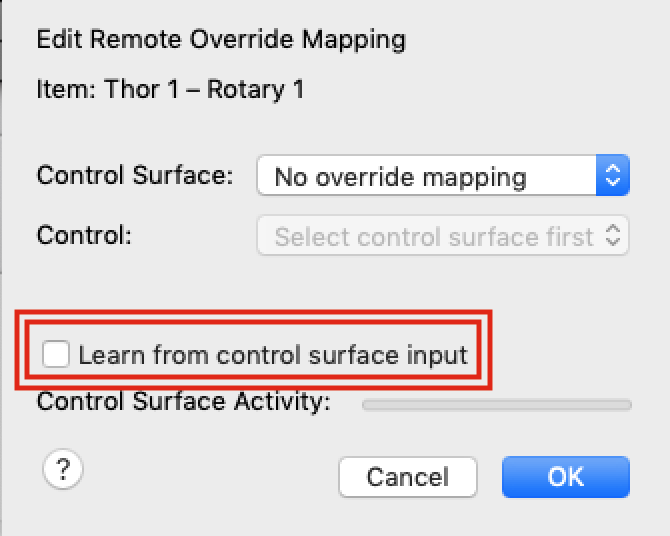
   >
   >   This is a side effect of the current manner in which **Reason** manages application state regarding preferences. In the event that a way to persist the end user preference of not wanting to learn from control surfaces by default becomes available, this step will no longer be necessary.
   >
   > **Trivia:**
   >
   > - The cause for concern over the **learn** option is because without turning it off, it would be impossible to select **Remote Overrides** from the list of possible options once the system is running. This is because **Reason** is trying to apply every connection where data exchange is being detected, simultaneously.

3. #### Loading the Control Surface Stack

   Control surfaces are queried in an internal array within **Reason** where the _first surfaces_ to appear in the list take priority over the _last surfaces_ to appear. Usually, any latency across surfaces is unnoticeable, but it becomes necessary to plan ahead when dealing with the large amount of Remote data that this project can utilize.

   In support of this important concept, we think of control surfaces as a "stack" where the surface at the top of the list is most important, while those toward the bottom are allowed to experience delays (if they occur) because they are not as critical in our setup.

   Here follows my best recommendation for the top entries of any custom stack you design:

- ### MIDI Controller

  - Navigate to **Preferences > Control Surfaces > Add**.

    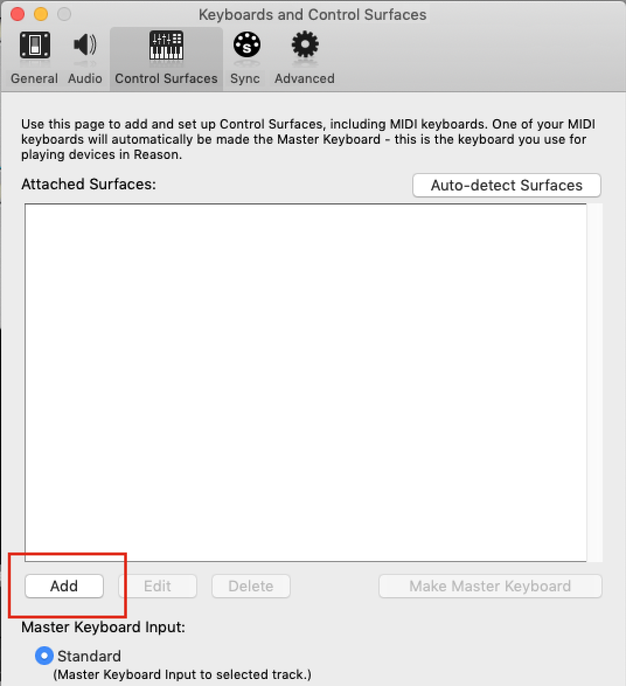

  - Locate the **DataBridge** manufacturer in the list.

    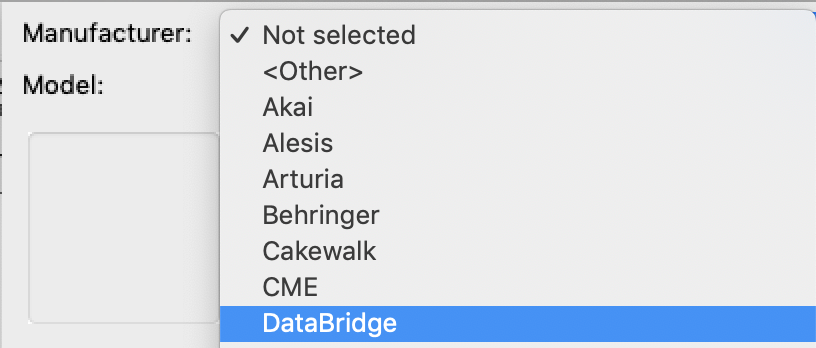

  - Select the **MIDI Controller** surface from the dropdown.

    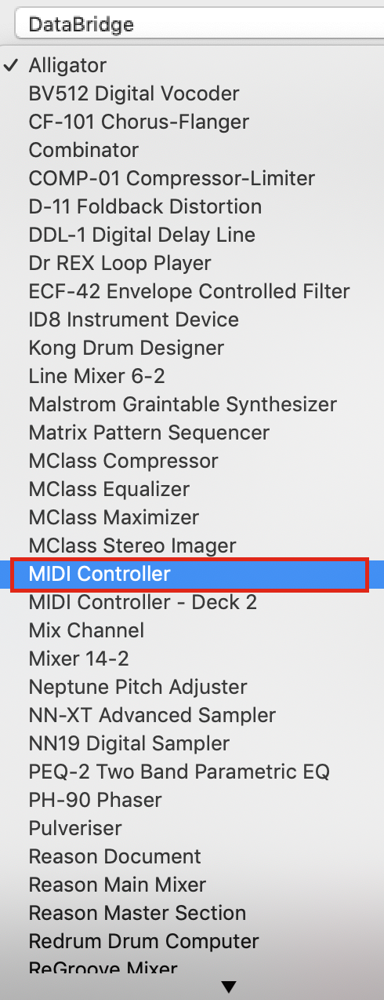

  - Mac Users:

    - Select the **Loopback Input** port that does **not** contain the word _"virtual"_
    - Select the **Loopback Output** port that does **not** contain the word _"virtual"_
    - Select the **UI Input** port that **does** contain the word _"virtual"_

      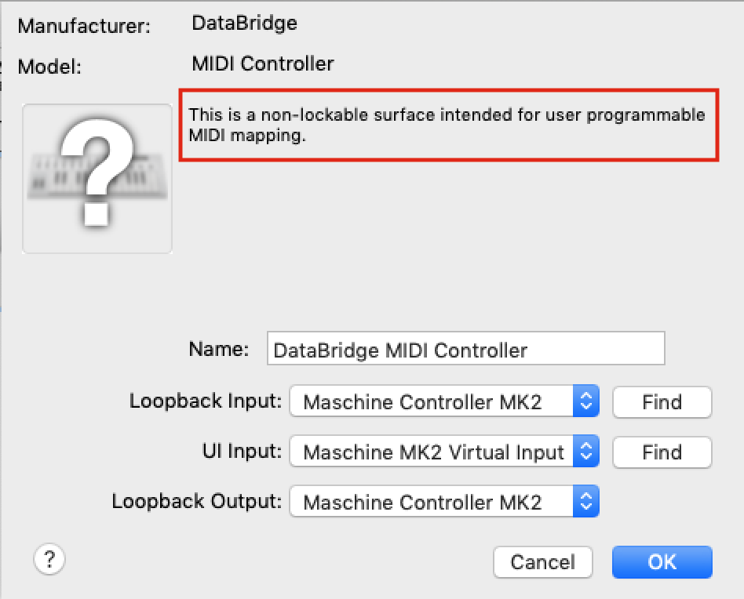

  - Windows Users:

    - The same as Mac Users, but you can leave **UI Input** empty.

      > **NOTE:**
      >
      > - If you want to use **TouchOSC** on either _Mac_ or _Windows_, you will need to select it inside **UI Input** for it to work.
      > - You can have your **Loopback Input** and **Output** running together on a separate looped port and use a different controller with its own connection to bring in data from **UI Input**.

  - Click OK to add the surface to the list.

- ### (Optional) MIDI Controller - Deck 2

  - Same as above, but you'll need another looped port to drive the second controller.
  - This optional second deck can also have its own TouchOSC or similar setup, allowing 4 controllers at once as the maximum configuration possible.

- ### Reason Document

  - Follow the same steps as above with respect to the **Reason Document** surface

    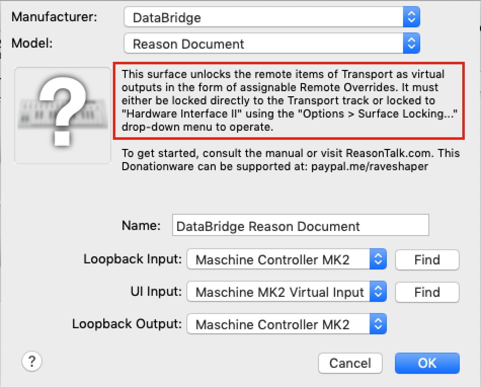

- ### Reason Master Section or Reason Main Mixer

  - The same steps above apply to these surfaces, however, they are mutually exclusive and _only one can be loaded at a time_.
    > - The **Reason Master Section**
    >
    >   - Loads quickly.
    >   - Enables use of all functionality in the **Master Section** device in the rack.
    >   - Can be used in combination with the **Mix Channel** surface.
    >
    > - The **Reason Main Mixer**
    >   - Loads _very slowly_.
    >   - Enables use of all functionality in the **Master Section** device in the rack.
    >   - Enables use of all functionality across up to **64 Mix Tracks** in the **Main Mixer**.
    >   - Can be extended using the **Mix Channel** surface in case _64 channels_ aren't enough.
    >     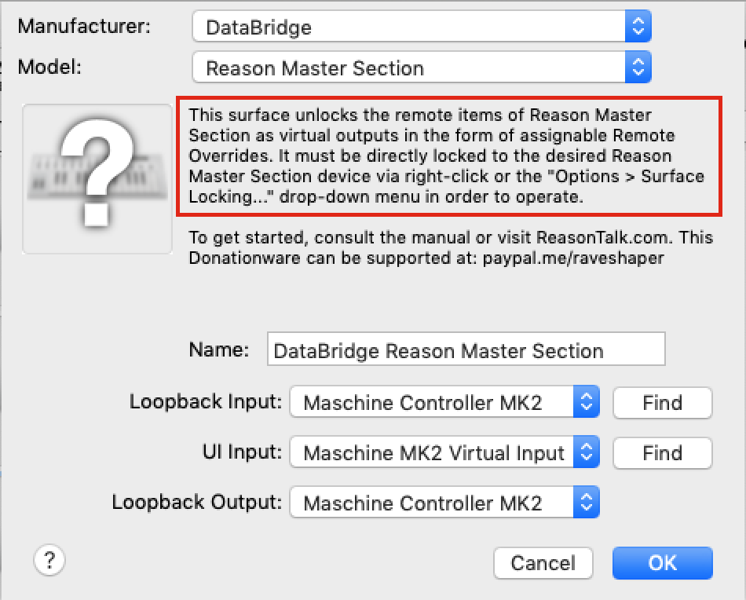

- ### ReGroove Mixer

  - Repeat the same steps as above for the **ReGroove Mixer** surface.

    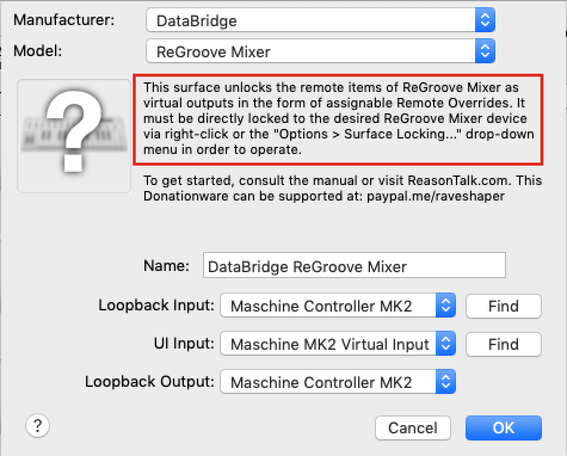

4. #### Ignore Triangle Warnings

   - By now you will see a **yellow warning triangle** next to all of the surfaces in the list. You can ignore these. All they are alerting us to is the fact that all of the surfaces share the same MIDI port. This is actually a good visual reference, because without that yellow triangle the whole system wouldn't work.

       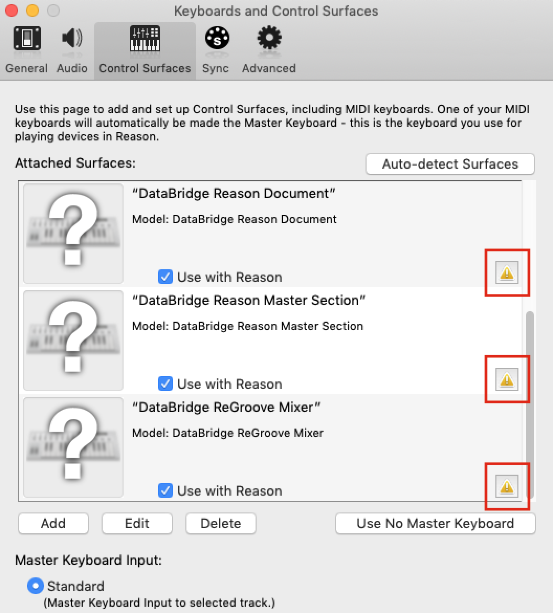

5. #### Disabling Master Keyboard

   - Once all of these surfaces are loaded, make sure that you have chosen to **Use No Master Keyboard** before you close the **Control Surfaces** list.

   - Assigning a **Master Keyboard** instructs **Reason** to disable certain MIDI connections internally in favor of others. This can result in undesired behavior inside of **DataBridge**.

   - _**Be careful to check this each time you load a surface designed for an instrument.**_

     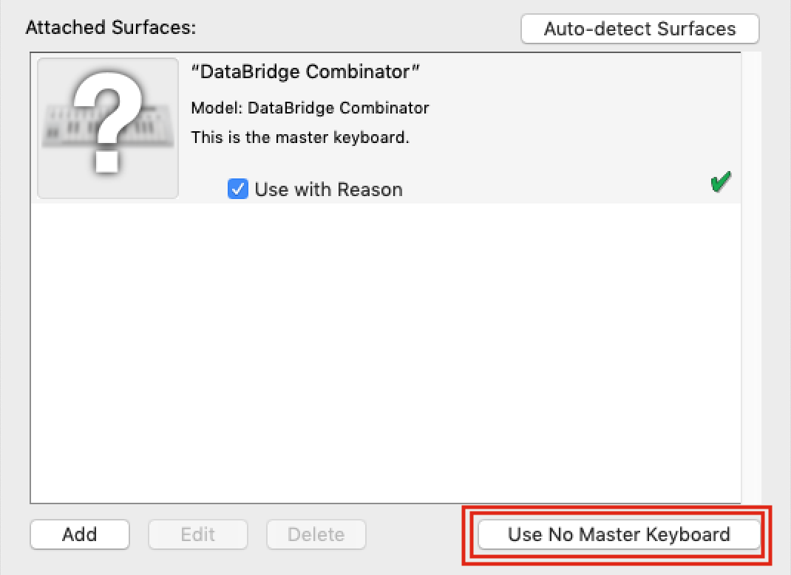

6. #### Locking the Control Surface Stack

   - Navigate to **Options > Surface Locking...**
   - Here you can apply the following adjustments to the stack we loaded in step 4 of this section:

     | Surface                  | Device Lock Destination        |
     | :----------------------- | :----------------------------- |
     | MIDI Controller          | _(do not assign lock)_         |
     | MIDI Controller - Deck 2 | _(do not assign lock if used)_ |
     | Reason Document          | Hardware Interface II          |
     | Reason Master Section    | Master Section                 |
     | Reason Main Mixer        | Master Section _(if used)_     |
     | ReGroove Mixer           | ReGroove Mixer                 |

   - A possible example stack list follows:

       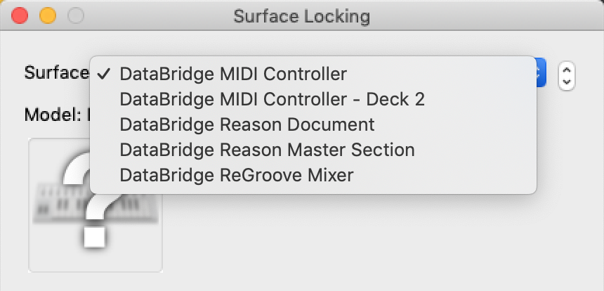

7. #### Mapping Connections in the Rack

This has been a lot of setup, but we have finally reached the main event for this implementation. Creating connections between front panel controls involves mapping Remote Overrides to knobs and other elements where links between rack units are desired. Before we proceed, let's develop a stronger understanding of the general structure of how the locked surfaces and Remote Overrides work in this system.

TODO:

1. #### Activating the DataBridge System
2. #### Programming Custom Modulations
3. #### Interpolating Modulations
4. #### Persistence of State in Your Projects
5. #### Warped Audio Resampling in the Sequencer
6. #### Using the Command Terminal
