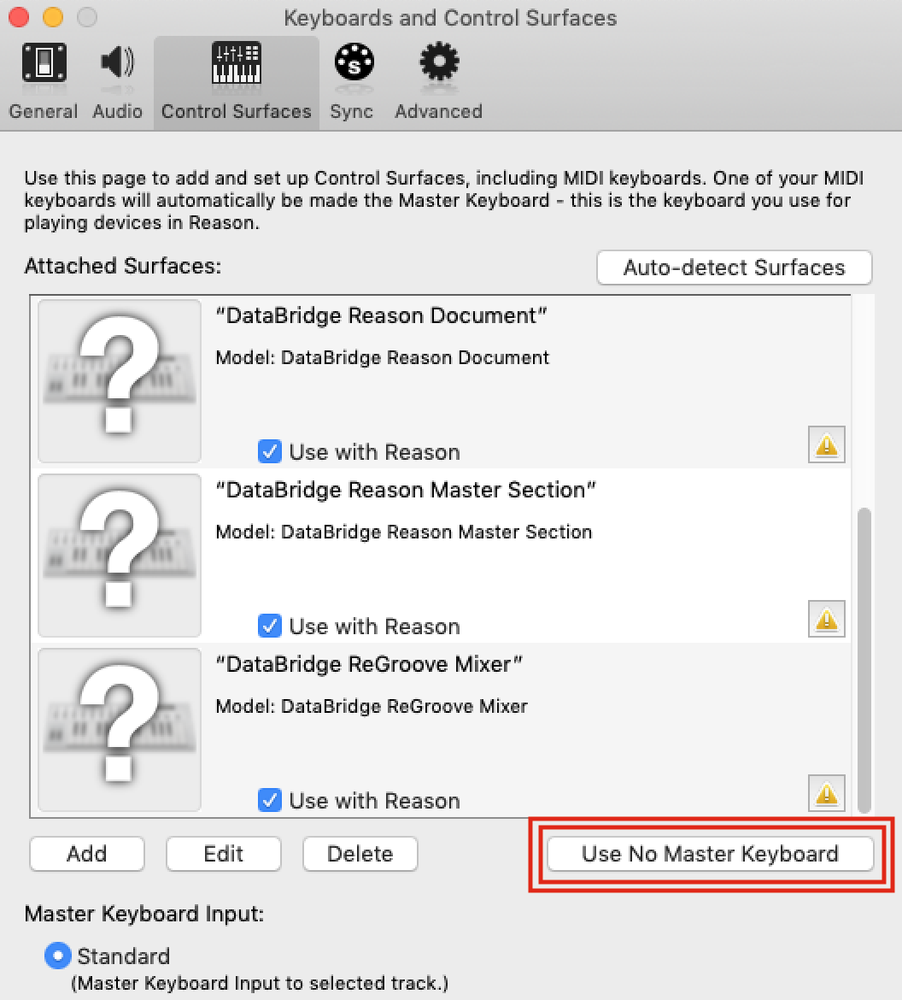

# DataBridge

---

## Contents

- [Overview](#overview)
- [Do I Need This](#do-i-need-this)
- [Why Was This Made?](#why-was-this-made)
- [What Does This Do?](#what-does-this-do)
  - [Deep MIDI Integration](#deep-midi-integration)
  - [Support for Live Performance](#support-for-live-performance)
  - [Auto-modulation](#auto-modulation)
  - [Audio Warping](#audio-warping)
- [Disclaimers](#disclaimers)
- [Installation](#installation)
  - [Quit Reason](#quit-reason)
  - [Physical MIDI Port](#physical-midi-port)
  - [Install Package Locally](#install-package-locally)
  - [Install Files](#install-files)
  - [Configure Workspace File](#configure-workspace-file)
- [Keyboard Controls](#keyboard-controls)
  - [Standard Interface](#standard-interface)
    - [Clock On/Off](#clock-on-off)
    - [Edit Min](#edit-min)
    - [Edit Max](#edit-max)
    - [Bipolar/Unipolar](#bipolar-unipolar)
  - [Advanced Interface](#advanced-interface)
    - [Edit Curve](#edit-curve)
    - [Edit Step](#edit-step)
  - [Master Mono Mix](#master-mono-mix)
    - [Stereo Width](#stereo-width)
- [Basic Usage](#basic-usage)

## Overview

**DataBridge** is an advanced MIDI control surface designed to provide a scalable, modular network of responsive connections between rack devices in **Propellerhead Reason 7+**.

Support for MIDI input is included and was designed to be hardware agnostic wherever possible. This allows both legacy and modern hardware to be used interchangeably.

## Do I Need This?

It depends whether you want to incorporate _organic sound design_ into your projects and/or _live performance capabilities_ into your workflows. If you prefer to be more scientific with all aspects of your work, this might not suit your tastes.

## Why Was This Made?

This project represents the best efforts at answering the call for missing features within **Propellerhead Reason 7** upon its release by providing a strong and comprehensive implementation of MIDI response that allows for live performance and organic sound design.

In short, it was made to redefine what is possible in **Reason**.

## What Does This Do?

- #### Deep MIDI Integration

  - Interaction with MIDI is now hardware agnostic, allowing for easy setup of multiple simultaneously connected device types including TouchOSC.

- #### Support for Live Performance

  - Powerful implementation of chained control mappings allow for distributed networks of MIDI response whose expressive capabilities are only limited by one's own imagination and computer specs.
  - This concept was taken even further with long live sets and duos in mind by wrapping support for distributed MIDI response inside a system of virtual layers; enabling the entire rack to be controlled using a scene/page system.

- #### Auto Modulation

  - An optional advanced feature allows for interpolation between values for knobs, sliders, and any other controls that can receive Remote Overrides.
  - Smoothness can be controlled using a custom wave table and transition speed setting.
  - Automation can even be automated to modulate itself, eliminating the need for automation lanes -- _and the CPU consumption caused by them._

- #### Audio Warping

  - A second optional advanced feature allows samples to be pitched in nonlinear ways while still preserving their original timing. Think of it as audio transpose with note glide.
  - Different time-stretching algorithms will give different results, allowing audio captures through the technique to become metallic, robotic, or tonal

---

## Disclaimers

> This guide will show examples based on **MacOS Mojave 10.14** and a **Native-Instruments Maschine Mk2** as the connected MIDI device. _Please substitute your MIDI hardware where applicable._
>
> This guide also assumes that **no other MIDI settings have already been specified** prior to the addition of these control surfaces. Additional troubleshooting may be required if you have a unique MIDI configuration already present in Reason.

> **Use of this system effectively removes Undo functionality from Reason while it is in operation. _This change is not permanent and will not harm your install._ This system is provided open source as-is and without warranty.**

## Installation

1. #### Quit Reason

   - This installation process requires Reason to be closed completely.

2. #### Physical MIDI Port

   - Attach a physical MIDI 5-pin In and Out port to your computer.
   - Physically loop these ports with a male-male **MIDI loopback cable** (Out port to In port)
     > **NOTE:**
     >
     > - **MIDI over IP with CopperLAN has been tested and is supported by the system.**
     > - **All other virtual ports like LoopBe1 will not work.**

3. #### Install Package Locally

   - **Download** this project as a zip file and extract it into a directory of your choice.
   - You can also use `git clone` over **SSH** if you have `git` installed.

      

4. #### Install Files

   - Locate the `Codecs/Lua Codecs` folder in your local install of this project.
   - Move the `DataBridge` folder into the `Codecs/Lua Codecs` folder used by your install of **Reason**.
   - Locate the `Maps` folder in your local install of this project.
   - Move the `DataBridge` folder into the `Maps` folder used by your install of **Reason**.
     > **For Help with Step 4, Please See:** [Control Remote](https://www.propellerheads.com/blog/control-remote)

5. #### Configure Workspace File

   - Start **Reason**.
   - Navigate to the `Templates and Patches` folder in your local install of this project.
   - Open the `Local Workspace.reason` file.
   - Navigate to the **Options** menu and turn on **Enable Keyboard Control**.

      

   - Locate the `DB Main` Combinator in the rack.

      

   - Turn on **Show Devices** to reveal the patch contents.
   - Configure the output port of each **External MIDI Instrument** (**EMI**)to use the Out port you looped in [step 2 of this section](#physical-midi-port), as shown in the example below.

      

   - Locate the `DB Curve` Combinator in the rack.

      

   - Configure its **EMI** outputs in the same manner as in the `DB Main` Combinator's patch.

      

   - Save the song file somewhere official. This will be your song template going forward.
   - Once `Local Workspace.reason` has been saved, close it.
   - Navigate to **Preferences > General > Default Song > Template**.
   - Set the `Local Workspace.reason` file as your new default song template as shown below.

      

> **NOTE:** _You can rename the `Local Workspace.reason` file to anything you prefer. File names remain standardized for the sake of readability._

---

## Keyboard Controls

The following **Keyboard Controls** are embedded in the `Local Workspace.reason` template:

- ### Legend

  - #### Standard Interface

    | DB Main                                        |                |
    | :--------------------------------------------- | :------------- |
    | <a id="clock-on-off">Clock On/Off</a>          | **Shift + /**  |
    |  Edit Min                 | **Shift + ,**  |
    |  Edit Max                 | **Shift + .**  |
    |  Bipolar/Unipolar | **Shift + \\** |

  - #### Advanced Interface

    | DB Curve                           |               |
    | :--------------------------------- | :------------ |
    |  Edit Curve | **Shift + ;** |
    |  Edit Step   | **Shift + [** |

  - Figure 1:

    

  - #### Master Mono Mix

    **DataBridge** also includes a pre-configured **mastering suite** called `Send 10` that includes a master mono mix fader. The mastering suite can be deleted without compromising the functionality of DataBridge if you want to remove it.

    | Mono Mix                              |               |
    | :------------------------------------ | :------------ |
    | Stereo Width | **Shift + M** |

  - Figure 2:

    

## Hardware Setup

**DataBridge** uses a select number of **MIDI Control Change** (**CC**) values to perform editing functions from hardware. These CC values effectively duplicate the Combinator buttons found on `DB Main` and `DB Curve` in the rack. This enables performers or producers to achieve the same results without having to stop using their controller.

The following CC values are reserved by the DataBridge system:

- ### Legend

  - #### Surface: DataBridge MIDI Controller

    | Channel | CC Value | Action                         |
    | :-----: | :------: | :----------------------------- |
    |    1    |    94    | System Panic\*      |
    |    1    |    95    | Bipolar/Unipolar               |
    |    1    |    97    | Edit Curve                     |
    |    1    |    98    | Edit Step                      |
    |    1    |    99    | Navigate Layers\*\* |
    |    1    |   100    | Edit Min                       |
    |    1    |   101    | Edit Max                       |
    |    8    |   119    | Clock                          |

  - #### Surface: DataBridge MIDI Controller - Deck 2

    | Channel | CC Value | Action                         |
    | :-----: | :------: | :----------------------------- |
    |    9    |    94    | System Panic\*      |
    |    9    |    95    | Bipolar/Unipolar               |
    |    9    |    97    | Edit Curve                     |
    |    9    |    98    | Edit Step                      |
    |    9    |    99    | Navigate Layers\*\* |
    |    9    |   100    | Edit Min                       |
    |    9    |   101    | Edit Max                       |
    |   16    |   119    | Clock                          |

> \* **System Panic** halts all loaded control surfaces from transmitting any data or making any calculations. This can be useful to do A/B testing of the system on and off, freezing the system in its current state, or fixing low priority problems.

| **WARNING:**                                                                                                                                                                                                                            |
| :-------------------------------------------------------------------------------------------------------------------------------------------------------------------------------------------------------------------------------------- |
| Be sure to cancel System Panic before loading any new surfaces after you have pressed it. Only the surfaces that are loaded and running will respond to user input, meaning the newest surfaces will be active while the rest will not. |

> \*\* **Navigate Layers** allows the user to move up and down through the page/scene system of virtual layers. This CC is expected to be a **relative** type with polarity and a step of 1. The jog wheel on the Native-Instruments Maschine Mk2 is used for this in the provided demo materials.

## Getting Started

1. #### Best Practice

   > The recommended best practice for using this system is to always have all of the `DB Main` and `DB Curve` Combinator buttons disabled and your MIDI controller(s) set to their initial state (all toggles off) when opening or closing a song project. This is important because the state of the system depends on that default scenario in order to calibrate itself during the process of loading the surfaces.

2. #### Priming the Workspace

   > When starting _**any**_ and _**every**_ project, it is essential and _**very important**_ to perform these tasks right away:
   >
   > - Right-click on any device control in the rack
   > - Select **Edit Remote Override**
   > - _Uncheck **Learn from control surface input**_
   > - Cancel out of the Remote Override editing window.
   >
   >   
   >
   >   This is a side effect of the current manner in which **Reason** manages application state regarding preferences. In the event that a way to persist the end user preference of not wanting to learn from control surfaces by default becomes available, this step will no longer be necessary.
   >
   > **Trivia:**
   >
   > - The cause for concern over the **learn** option is because without turning it off, it would be impossible to select **Remote Overrides** from the list of possible options once the system is running. This is because **Reason** is trying to apply every connection where data exchange is being detected, simultaneously.

3. #### Loading the Control Surface Stack

   Control surfaces are queried in an internal array within **Reason** where the _first surfaces_ to appear in the list take priority over the _last surfaces_ to appear. Usually, any latency across surfaces is unnoticeable, but it becomes necessary to plan ahead when dealing with the large amount of Remote data that this project can utilize.

   In support of this important concept, we think of control surfaces as a "stack" where the surface at the top of the list is most important, while those toward the bottom are allowed to experience delays (if they occur) because they are not as critical in our setup.

   Here follows my best recommendation for the top entries of any custom stack you design:

- ### MIDI Controller

  - Navigate to **Preferences > Control Surfaces > Add**.

    

  - Locate the **DataBridge** manufacturer in the list.

    

  - Select the **MIDI Controller** surface from the dropdown.

    

  - Mac Users:

    - Select the **Loopback Input** port that does **not** contain the word _"virtual"_
    - Select the **Loopback Output** port that does **not** contain the word _"virtual"_
    - Select the **UI Input** port that **does** contain the word _"virtual"_

      

  - Windows Users:

    - The same as Mac Users, but you can leave **UI Input** empty.

      > **NOTE:**
      >
      > - If you want to use **TouchOSC** on either _Mac_ or _Windows_, you will need to select it inside **UI Input** for it to work.
      > - You can have your **Loopback Input** and **Output** running together on a separate looped port and use a different controller with its own connection to bring in data from **UI Input**.

  - Click OK to add the surface to the list.

- ### (Optional) MIDI Controller - Deck 2

  - Same as above, but you'll need another looped port to drive the second controller.
  - This optional second deck can also have its own TouchOSC or similar setup, allowing 4 controllers at once as the maximum configuration possible.

- ### Reason Document

  - Follow the same steps as above with respect to the **Reason Document** surface

    

- ### Reason Master Section or Reason Main Mixer

  - The same steps above apply to these surfaces, however, they are mutually exclusive and _only one can be loaded at a time_.
    > - The **Reason Master Section**
    >
    >   - Loads quickly.
    >   - Enables use of all functionality in the **Master Section** device in the rack.
    >   - Can be used in combination with the **Mix Channel** surface.
    >
    > - The **Reason Main Mixer**
    >   - Loads _very slowly_.
    >   - Enables use of all functionality in the **Master Section** device in the rack.
    >   - Enables use of all functionality across up to **64 Mix Tracks** in the **Main Mixer**.
    >   - Can be extended using the **Mix Channel** surface in case _64 channels_ aren't enough.
    >     

- ### ReGroove Mixer

  - Repeat the same steps as above for the **ReGroove Mixer** surface.

    

4. #### Ignore Triangle Warnings

   - By now you will see a **yellow warning triangle** next to all of the surfaces in the list. You can ignore these. All they are alerting us to is the fact that all of the surfaces share the same MIDI port. This is actually a good visual reference, because without that yellow triangle the whole system wouldn't work.

       

5. #### Disabling Master Keyboard

   - Once all of these surfaces are loaded, make sure that you have chosen to **Use No Master Keyboard** before you close the **Control Surfaces** list.

   - Assigning a **Master Keyboard** instructs **Reason** to disable certain MIDI connections internally in favor of others. This can result in undesired behavior inside of **DataBridge**.

   - _**Be careful to check this each time you load a surface designed for an instrument.**_

     

6. #### Locking the Control Surface Stack

   - Navigate to **Options > Surface Locking...**
   - Here you can apply the following adjustments to the stack we loaded in step 4 of this section:

     | Surface                  | Device Lock Destination        |
     | :----------------------- | :----------------------------- |
     | MIDI Controller          | _(do not assign lock)_         |
     | MIDI Controller - Deck 2 | _(do not assign lock if used)_ |
     | Reason Document          | Hardware Interface II          |
     | Reason Master Section    | Master Section                 |
     | Reason Main Mixer        | Master Section _(if used)_     |
     | ReGroove Mixer           | ReGroove Mixer                 |

   - A possible example stack list follows:

       

7. #### Understanding the Core Architecture

We have laid the groundwork for being able to make connections between devices using their front panel controls, but first we should discuss the core architecture that we're using and how it actually works.

_Figure A._

The implementation of the **Remote** protocol in **Reason** was designed to handle incoming MIDI data, so it is effectively blind to data changes within Reason because no incoming MIDI is received. To allow the locked surfaces of **DataBridge** to "see" data changes in the rack and read the values of those changes, we must send a pulse of MIDI into Reason (Clock On/Off button). Receiving this pulse triggers the following sequence of events as shown in the diagram:

- ### MIDI Flow
  1. MIDI pulse from `Clock` **EMI** inside `DB Main` is looped in
  2. Control surface "stack" is iterated
  3. Each surface fires "**remote_set_state**" MIDI handler
  4. Value of all **Inputs** for the surface are read
  5. **Input** values are stored in a global variable ("**g_batch**")
  6. "**remote_process_midi**" fires to handle the incoming MIDI
  7. Contents of "**g_batch**" array are written to the surface **Outputs**
  8. Surface **Outputs** are the **Remote Overrides** we map to make connections
  9. **Result:**
     - changes in value on **Input(s)** are written as changes to mapped **Output(s)**

Because we can make such a large volume of changes at once, it would be impossible to send a MIDI value specific to each connection between device controls. Instead, we send a single global pulse of MIDI through the Loopback Output and Loopback Input ports, then read input values directly from the rack in all the locked surfaces before writing new output values to all of the mapped Remote Overrides.

This means that no MIDI data is being passed between devices when making changes. _All data is handled internally inside of all the locked surfaces_. Additionally, all unmapped Remote Overrides are ignored, reducing latency wherever possible.

> It is worthy to note that much of the complexity of installation and latency encountered when putting this system into heavy use within a project could be eased by allowing Remote to directly query the rack using a scripted loop instead of strictly requiring incoming MIDI.

Incoming MIDI information from either a controller or from the looped **EMI** signals found inside the `DB Main` and `DB Curve` **Combinators** (listed at top-left of diagram) are also handled in this same way, but since they are MIDI information themselves, they do not require a pulse from the `Clock` **EMI** to work.

To simplify these concepts, you can think of these input messages from controllers and in-rack interfaces as being merged with the looped pulse that runs the data handling.

8. #### Mapping Connections in the Rack

This has been a lot of setup, but we have finally reached the main event. Creating connections between front panel controls! This involves mapping Remote Overrides to knobs and other elements where links between rack units are desired. Before we proceed, let's develop a stronger understanding of the general structure of how the locked surfaces and Remote Overrides work in this system.

_Figure B._

When a **DataBridge** surface is locked to a device, all of the device's controls become bound to the default **Inputs** in the surface script. These are the values that DataBridge reads using **remote_set_state** as explained in _Figure A_ in the previous section.

The locked surface then calculates a scalar value between 0 and 1 based on the data value for a given Input, as well as its associated minimum and maximum values, if any. This scalar value is then multiplied by the difference of the minimum and maximum values associated with each of the specific Remote Overrides that act as the "virtual outputs" for the given Input.

The resulting products of these multiplications are then stored into a global array named **g_batch** until the contents of the array are written to the Remote Overrides the next time **remote_process_midi** fires.

If the destination device where the Remote Overrides are mapped also has a DataBridge surface locked to it, a **modulation chain** can be established with more than one device connected in series.

The first device in a modulation chain can be driven by automation changes or direct MIDI input as well as Remote Overrides from a MIDI Controller surface provided by DataBridge.

> **NOTE:** Because Reason does not support instancing or concurrency of control surfaces, you must create a new surface for every device you want to control with this system. At this time, loading control surfaces in Reason does not afford any way of defining "packaged" configurations for quick loading. If this feature becomes available in the future it would greatly reduce the pain point of manually loading individual surfaces.

Now that we have covered how surfaces can be chained and the general functionality of how they handle data, you can begin creating connections between devices by mapping Remote Overrides however you would like.

There is only one rule that you must follow when mapping Remote Overrides.

- Remote Overrides must be mapped to another device, not the source device that is generating the Remote Overrides.
- To put it more simply, devices must not map Remote Overrides back to themselves.

While this won't break anything in a catastrophic way, the rule exists because any device that does map back to itself is not able to drive modulation chains. Some aspects of data handling may also behave unpredictably because the data is looping in on itself instead of broadcasting to an outer destination.

9. #### Activating the DataBridge System

Activating the system is as simple as activating the `Clock On/Off` button on the `DB Main` Combinator. Once activated, all surfaces loaded into **Reason** will begin processing data as expected, according to the pulse rate setting of the `Clock Rate` rotary knob.

> **WARNING:** It is absolutely imperative that you do not select or interact with any **External MIDI Instrument** (**EMI**) devices in the rack while the DataBridge system is activated. Doing so will create an endless loop of MIDI information inside of Reason that cannot be fixed without completely quitting the app and restarting it. This will cause all custom modulations in the open project to be lost.

10. #### Programming Custom Modulations

Each device control that receives manipulations from a mapped "virtual output" Remote Override can be programmed to exhibit unique behavior as desired. All programming takes place where it is desired by manually adjusting affected controls. The basic adjustments that can be made are specifying minimum and maximum values.

To change the minimum or maximum value, simply activate either the `Edit Min` or `Edit Max` button while the `Clock On/Off` button is active, then adjust the control you want to program changes into. Once the value has been set, deactivate the `Edit Min` or `Edit Max` button to write the value into the DataBridge system.

If you activate both the `Edit Min` and `Edit Max` buttons at once, the device control will receive a static value that will not change in response to manipulations from hardware or automation clips.

If you set a larger minimum value than a smaller maximum value, the polarity of the modulation will be reversed for that control.

If no changes are applied, make sure you are adjusting a control that has a Remote Override supplied by a DataBridge surface mapped to it.

You can make as many changes to mapped controls as you like without destructive results, meaning any controls that you do not adjust will remain unaltered in their expected behavior. There is only one exception to this, as follows:

> If you activate `Edit Min` or `Edit Max` while utilizing automatic modulations as provided by the **BV512 Digital Vocoder**, the automatic adjustments will destructively reprogram all connections that are driven by the virtual outputs of the vocoder's DataBridge control surface.

That said, in order to apply automatic modulations in response to audio, you can easily map the `Mod Level` outputs of the BV512 unit to automatically drive modulation chains. Just be careful when reprogramming.

11. #### Interpolating Modulations

Support for nonlinear automation changes similar to curved automation is included in DataBridge as an optional feature. Activation of this advanced tool is at the user's discretion.

To engage the optional interpolation of control changes, you must activate the `Edit Curve` or `Edit Step` buttons on the `DB Curve` Combinator in a very similar fashion to the way `Edit Min` and `Edit Max` are used to program custom modulations in the previous section.

Once `Edit Curve` is activated, adjusting the value of a control will change the type of curve applied to smooth between its values. The curve types are effectively a smooth and continuous custom wave table whose unique values are as follows:

| Value | Description                       |
| :---- | :-------------------------------- |
| 0     | Instant / On                      |
| 18    | Reciprocal / Fast Attack          |
| 36    | Logarithm / Ease-In               |
| 54    | Sine / Ease-In-Out                |
| 73    | Tangent / Hesitate                |
| 91    | Inverse Logarithm / Ease-Out      |
| 109   | Inverse Reciprocal / Fast Release |
| 127   | Hard Delay / Off                  |

The default setting is "Instant".

> **Note:** If you are adjusting interpolation values for a control that involves settings outside the range of 0 to 127, you will have to calculate corresponding settings within that range of values. Each value is evenly spaced one seventh (1/7) of the total range of values for the given control being edited.

When `Edit Step` is activated, adjusting the value of a control will change the speed of the interpolation between its values. The range of values varies as follows:

| Value | Description                                            |
| :---- | :----------------------------------------------------- |
| 0     | Slowest (127 pulses of `Clock` EMI in `DB Main`)       |
| 127   | Fastest (1 pulse, effectively an "Instant" curve type) |

The default setting is "Fastest".

It is important to understand that editing the `Curve` and `Step` for a control will not destructively edit the minimum or maximum values for those same controls. Each control that is adjusted during any given edit mode is only updated with respect to the modes that are currently active (buttons toggled on). All other features that are not in use will not be affected.

12. #### Warped Audio Resampling in the Sequencer

DataBridge also includes support for an advanced method of warping audio. This is accomplished by applying a calculation that adjusts the BPM of the transport bar to match the playback speed of a sample, given an arbitrary pitch bend value.

In short, it is possible to bind the recording speed of the song project to the pitch of a sample.

The purpose behind this feature is to allow for nonlinear resampling where the pitch of a sampler and the recording speed of an audio track can be matched 1:1. The result, when played back at a fixed tempo using the time-stretch algorithms, is a "warped" version of the sample that exhibits nonlinear changes in pitch while preserving the original timing of the sample.

This is in stark contrast to the fixed, global change in root semitone that occurs when applying transpose to an audio sample. Also, under normal conditions, pitched samples exhibit faster or slower playback speeds compared to the original recording.

You can think of this as an abstract form of note glide, but for audio recordings.

This advanced functionality is made available inside of the DataBridge surfaces designed for use with the Combinator and the stock instruments. The instrument surfaces allow for a maximum range of plus or minus 24 semitones and will respond to changes in pitch bend range. The Combinator surface allows for a maximum range of plus or minus 60 semitones and restricts the base tempo of the song project to 32 BPM while in use.

The feature is activated by binding the `Pitch Bend - To Tempo BPM` and `Pitch Bend - To Tempo Decimal` Remote Overrides to their intended destinations on the transport bar. Please insure you have selected the correct surface if you have multiple instruments integrated into your DataBridge configuration.

> **Note:** If adjustment of the pitch wheel does not succeed in adjusting the tempo settings on first use, follow these steps:
>
> - Open Preferences > Control Surfaces
> - Deactivate the surface mapped to the transport controls
> - Activate `Clock On/Off` on `DB Main`
> - Reactivate the surface mapped to the transport controls
> - Confirm tempo changes by adjusting pitch wheel

In order to make practical use of this feature, you must activate the **Rec Output** option on the device whose pitch wheel is bound to the transport speed controls. Record the output of the device on a dedicated Audio Track in order to print a "warped" clip based on the original audio source.

If you intend to use the Combinator surface with its larger plus or minus 60 semitone range, you must use a CV Spider Merger/Splitter to scale up the pitch wheel value to 2.5 times normal. This can be accomplished using three copies of the pitch from the splitter section passed through two values of 127 and one value of 63 for the three trim knobs on the merger section. Apply the final output of the spider's merger to the pitch input of the sampler or instrument you want to use.

Once the audio has been warped by capturing to audio track, you can either clear the Remote Overrides from the tempo controls, or otherwise deactivate the surface related to those mappings before playing back the result at the desired BPM. Experiment with different stretch algorithms to hear different textural results.

Be advised that warping upward will introduce a lot of harmonics because the playback speed will overtake the rate at which values of project tempo can be changed. In other words, the higher the pitch, the more chaos and imprecision the result will have.

Generally speaking, use of the instrument surfaces will be more predictable and musical, while use of the Combinator surface is intended for extreme manipulations or avant-garde applications.

The restriction of the project's working tempo to a setting of 32 BPM is a requirement imposed by the maximum pitch bend a sampler can achieve, which is roughly plus or minus 5 octaves (60 semitones). This is equivalent to a change in speed that ranges from one thirty-second (1/32) the original playback at its slowest, or a BPM of 1; and thirty-two (32) times the original playback at its fastest, or a BPM of 1024 (999 being maximum possible). This drastic range in possible speeds requires a baseline project speed of 32 BPM in order to maintain the preservation of original timing contained in the sample being warped.

While samples were the original focus of this technique, you can also warp the standard output of instruments or effects to achieve unexpected results.

13. #### Persistence of State in Your Projects

Unfortunately, there is no support for persistence of state within control surfaces inside of Reason as of the time of this release. This is a limitation of the software as it currently stands.

_**All custom modulations and interpolation curve settings defined by the user will be lost under the following conditions:**_

- **Looped MIDI port is disconnected from the host computer**
- **Project is closed**
- **Computer is hibernated**
- **Computer is turned off**

If future versions of Reason implement a state management system for control surfaces with support for embedding control surface configurations and data into project files to address this shortcoming, this section can be disregarded. Until then, use of DataBridge must be treated as volatile and sensitive to the time and place where it is used.

If you want to be able to recreate a sound that is generated by the system, you will need to develop strategies for independent documentation of all pertinent details relating to your use of DataBridge that resulted in the sound you wish to reproduce. Only through manual reconfiguration of these settings will you be able to approximate the sound. Even once you reproduce a given sound, please understand that all modulations in this system are pseudo-random. No two sounds will be precisely identical even from one note to the next.

14. #### Using the Command Terminal

The final feature set provided is a command terminal bound to the `Device Name` parameter of all surface types. Through this terminal, you can quickly setup the entire surface for immediate use, activate hidden options that allow for even more advanced control, or reset all custom modulations back to the default state when the surface was first loaded.

When using the `MIDI Controller` and `MIDI Controller - Deck 2` controllers, you must configure them by temporarily locking them to any stock Reason device so that the command terminal can be accessed using the Device Name parameter. **It is important that you unlock them once they are configured.**

Advanced settings that can be accessed include binding to a surface to a precise midi channel, unlocking the page/scene virtual layering system, and enabling variable speed sensitivity for compatibility with endless rotary encoders on modern hardware.

TODO: Add documentation of terminal commands
