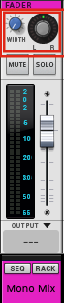

# Data Bridge

---
## Contents

  - [Overview](#overview)
  - [Do I Need This](#do-i-need-this)
  - [Why Was This Made?](#why-was-this-made)
  - [What Does This Do?](#what-does-this-do)
      - [Deep MIDI Integration](#deep-midi-integration)
      - [Support for Live Performance](#support-for-live-performance)
      - [Auto-modulation](#auto-modulation)
      - [Audio Warping](#audio-warping)
  - [Disclaimers](#disclaimers)
  - [Installation](#installation)
      - [Quit Reason](#quit-reason)
      - [Physical MIDI Port](#physical-midi-port)
      - [Install Package Locally](#install-package-locally)
      - [Install Files](#install-files)
      - [Configure Workspace File](#configure-workspace-file)
  - [Keyboard Controls](#keyboard-controls)
      - [Standard Interface](#standard-interface) 
          - [Clock On/Off](#clock-on-off)
          - [Edit Min](#edit-min)
          - [Edit Max](#edit-max)
          - [Bipolar/Unipolar](#bipolar-unipolar)
      - [Advanced Interface](#advanced-interface)
          - [Edit Curve](#edit-curve)
          - [Edit Step](#edit-step)
      - [Master Mono Mix](#master-mono-mix)
          - [Stereo Width](#stereo-width)  
  - [Basic Usage](#basic-usage)

## Overview

**DataBridge** is an advanced MIDI control surface designed to provide a scalable, modular network of responsive connections between rack devices in **Propellerhead Reason 7+**.

Support for MIDI input is included and was designed to be hardware agnostic wherever possible. This allows both legacy and modern hardware to be used interchangeably.

## Do I Need This?

It depends whether you want to incorporate _organic sound design_ into your projects and/or _live performance capabilities_ into your workflows. If you prefer to be more scientific with all aspects of your work, this might not suit your tastes.

## Why Was This Made?

This project represents the best efforts at answering the call for missing features within **Propellerhead Reason 7** upon its release by providing a strong and comprehensive implementation of MIDI response that allows for live performance and organic sound design.

In short, it was made to redefine what is possible in **Reason**.

## What Does This Do?

* #### Deep MIDI Integration

    - Interaction with MIDI is now hardware agnostic, allowing for easy setup of multiple simultaneously connected device types including TouchOSC.

* #### Support for Live Performance

    - Powerful implementation of chained control mappings allow for distributed networks of MIDI response whose expressive capabilities are only limited by one's own imagination and computer specs.
    - This concept was taken even further with long live sets and duos in mind by wrapping support for distributed MIDI response inside a system of virtual layers; enabling the entire rack to be controlled using a scene/page system.

* #### Auto Modulation

    - An optional advanced feature allows for interpolation between values for knobs, sliders, and any other controls that can receive Remote Overrides.
    - Smoothness can be controlled using a custom wave table and transition speed setting.
    - Automation can even be automated to modulate itself, eliminating the need for automation lanes -- _and the CPU consumption caused by them._

* #### Audio Warping

    - A second optional advanced feature allows samples to be pitched in nonlinear ways while still preserving their original timing. Think of it as audio transpose with note glide.
    - Different time-stretching algorithms will give different results, allowing audio captures through the technique to become metallic, robotic, or tonal

---

## Disclaimers

>This guide will show examples based on **MacOS Mojave 10.14** and a **Native-Instruments Maschine Mk2** as the connected MIDI device. _Please substitute your MIDI hardware where applicable._
>
>This guide also assumes that **no other MIDI settings have already been specified** prior to the addition of these control surfaces. Additional troubleshooting may be required if you have a unique MIDI configuration already present in Reason.

>**Use of this system effectively removes Undo functionality from Reason while it is in operation. _This change is not permanent and will not harm your install._ This system is provided open source as-is and without warranty.**

## Installation

1. #### Quit Reason
   - This installation process requires Reason to be closed completely.

2. #### Physical MIDI Port
   - Attach a physical MIDI 5-pin In and Out port to your computer.
   - Physically loop these ports with a male-male **MIDI loopback cable** (Out port to In port)
> **NOTE: virtual ports like LoopBe1 will not work.**

3. #### Install Package Locally
   - **Download** this project as a zip file and extract it into a directory of your choice.
   - You can also use `git clone` over **SSH** if you have `git` installed.

      

4. #### Install Files
   - Locate the `Codecs/Lua Codecs` folder in your local install of this project.
   - Move the `DataBridge` folder into the `Codecs/Lua Codecs` folder used by your install of **Reason**.
   - Locate the `Maps` folder in your local install of this project.
   - Move the `DataBridge` folder into the `Maps` folder used by your install of **Reason**.
> **For Help with Step 4, Please See:** [Control Remote](https://www.propellerheads.com/blog/control-remote)

5. #### Configure Workspace File
   - Start **Reason**.
   - Navigate to the `Templates and Patches` folder in your local install of this project.
   - Open the `Local Workspace.reason` file.
   - Navigate to the **Options** menu and turn on **Enable Keyboard Control**.

      

   - Locate the `DB Main` Combinator in the rack.

      

   - Turn on **Show Devices** to reveal the patch contents.
   - Configure the output port of each **External MIDI Instrument** (**EMI**)to use the Out port you looped in [step 2 of this section](#physical-midi-port), as shown in the example below.

      

   - Locate the `DB Curve` Combinator in the rack.

      

   - Configure its **EMI** outputs in the same manner as in the `DB Main` Combinator's patch.

      

   - Save the song file somewhere official. This will be your song template going forward.
   - Once `Local Workspace.reason` has been saved, close it.
   - Navigate to **Preferences > General > Default Song > Template**.
   - Set the `Local Workspace.reason` file as your new default song template as shown below.

      

> **NOTE:** _You can rename the `Local Workspace.reason` file to anything you prefer. File names remain standardized for the sake of readability._

---

## Keyboard Controls

The following **Keyboard Controls** are embedded in the `Local Workspace.reason` template:

* ### Legend
    - #### Standard Interface

      | DB Main                                        |                |
      | :--------------------------------------------- | :------------- |
      | <a id="clock-on-off">Clock On/Off</a>          | **Shift + /**  |
      |  Edit Min                 | **Shift + ,**  |
      |  Edit Max                 | **Shift + .**  |
      |  Bipolar/Unipolar | **Shift + \\** |

    - #### Advanced Interface

      | DB Curve                           |               |
      | :--------------------------------- | :------------ |
      |  Edit Curve | **Shift + ;** |
      |  Edit Step   | **Shift + [** |

    - Figure 1:
    
      
    
    - #### Master Mono Mix
      
      **DataBridge** also includes a pre-configured **mastering suite** called `Send 10` that includes a master mono mix fader. The mastering suite can be deleted without compromising the functionality of DataBridge if you want to remove it.

      | Mono Mix                              |               |
      | :------------------------------------ | :------------ |
      | Stereo Width | **Shift + M** |

    - Figure 2:

      

## Basic Usage

1. #### Best Practice

    > The recommended best practice for using this system is to always have all of the `DB Main` and `DB Curve` Combinator buttons disabled and your MIDI controller(s) set to their initial state (all toggles off) when opening or closing a song project. This is important because the state of the system depends on that default scenario in order to calibrate itself during the process of loading the surfaces.
    >
    > With that in mind, let's walk through a simple setup using auto-modulation.
Upon successful installation, simply load a stock device and lock its dedicated control surface to it from the `DataBridge` list of surfaces.
>**NOTE:** If the lock option isn't available, you will need to select _Disable Master Keyboard_ first.

Once this initial surface is locked, you can bind its outputs to any other rack unit by selecting them from the list when assigning **Remote Overrides**.

You can scale this process to create control chains of arbitrary length according to your computer's specs.

>**IMPORTANT:**
>- In order for data to propagate from one device to another, each device that is to send data out to a destination must have its own dedicated control surface locked to it.
>- A device receiving data from another device does not require a control surface by default.

Once all **Remote Overrides** have been mapped, you must prime the system by disconnecting your looped MIDI port, then plugging it back in.

Now simply activate the `Clock On/Off` button on the **Combinator** and adjust the control(s) whose outputs you mapped to a destination device.

You should see both controls moving even though you have only selected one.

>**NOTE:** You can access items that cannot be controlled by external hardware as sources for outgoing data from a device, such as VU Meters, LEDs, and others.